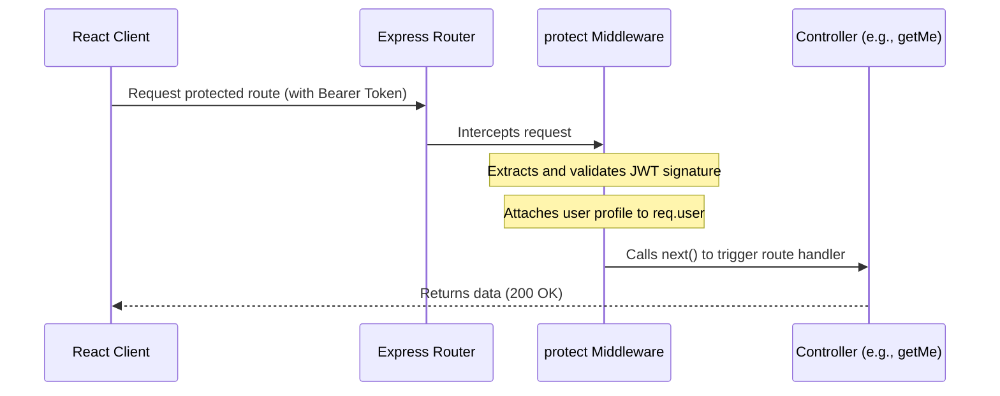

# Phase 20: Authentication Middleware Documentation

This phase implements route guards using JSON Web Tokens (JWT) to protect private API endpoints.

---

## 🔒 Protect Middleware: `authMiddleware.js`

Defined in [server/middleware/authMiddleware.js](file:///d:/CP-Scheduler/server/middleware/authMiddleware.js):

```javascript
const jwt = require('jsonwebtoken');
const User = require('../models/User');

exports.protect = async (req, res, next) => {
  try {
    let token;

    // 1. Read Authorization Header (expected format: "Bearer <JWT_TOKEN>")
    if (req.headers.authorization && req.headers.authorization.startsWith('Bearer')) {
      token = req.headers.authorization.split(' ')[1];
    }

    // If no token is provided, abort with 401 Unauthorized
    if (!token) {
      const error = new Error('Not authorized, no token provided');
      error.statusCode = 401;
      return next(error);
    }

    // 2. Verify JWT Signature
    const decoded = jwt.verify(token, process.env.JWT_SECRET);

    // 3. Attach user information to request context (excluding password hash)
    const user = await User.findById(decoded.id).select('-password');
    if (!user) {
      const error = new Error('Not authorized, user not found');
      error.statusCode = 401;
      return next(error);
    }

    // Store user document on request object
    req.user = user;

    // 4. Call next() to proceed to the controller
    next();
  } catch (error) {
    error.statusCode = 401;
    next(error);
  }
};
```

---

## 🔄 Middleware Execution Flow



1. **Request Interception**: Express routes the request to the `protect` middleware before hitting the controller.
2. **Extraction**: The middleware reads the `Authorization` header, splitting the string to isolate the raw JWT.
3. **Validation Boundary**:
   - If the token is missing, invalid, or expired, execution halts, returning a `401 Unauthorized` response to the client.
   - If the token is valid, it retrieves the user profile from MongoDB, removes the password field, and attaches the profile to `req.user`.
4. **Handoff**: The middleware calls `next()`, prompting Express to run the actual controller function.
