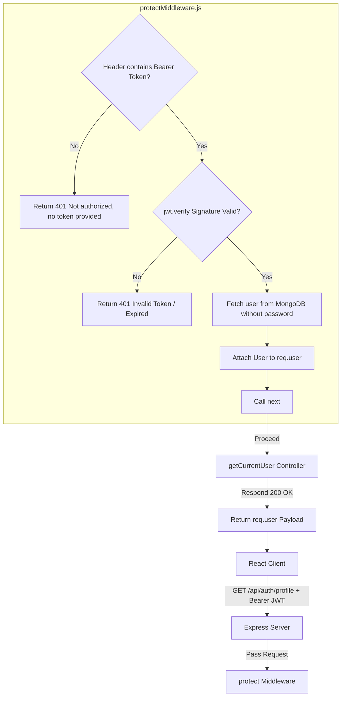

# Phase 21: Protected Profile Route Documentation

This phase implements a protected test route `GET /api/auth/profile` allowing logged-in users to fetch their profile details securely.

---

## 📍 Route Definition: `GET /profile`

Mapped in [server/routes/authRoutes.js](file:///d:/CP-Scheduler/server/routes/authRoutes.js):

```javascript
router.get('/profile', protect, getCurrentUser);
```

Mapped to `getCurrentUser` in [server/controllers/authController.js](file:///d:/CP-Scheduler/server/controllers/authController.js):

```javascript
exports.getCurrentUser = async (req, res, next) => {
  try {
    res.status(200).json({
      status: 'success',
      data: {
        user: formatUserResponse(req.user)
      }
    });
  } catch (error) {
    next(error);
  }
};
```

---

## 🔄 Request Flow & Middleware Execution



1. **Client Request**: The client requests `/api/auth/profile` and attaches the token in the `Authorization` header.
2. **Middleware Interception**: The `protect` middleware runs first:
   - Reads the token.
   - Verifies the signature with `jwt.verify()`.
   - Queries MongoDB using the token's payload user ID.
   - Strips the password out of the retrieved user document.
   - Attaches the user object to the request context: `req.user = user`.
   - Calls `next()`.
3. **Controller Execution**: The `getCurrentUser` controller retrieves the pre-attached user details from `req.user`, processes them through the `userFormatter`, and returns the profile details to the client in a JSON success response.
