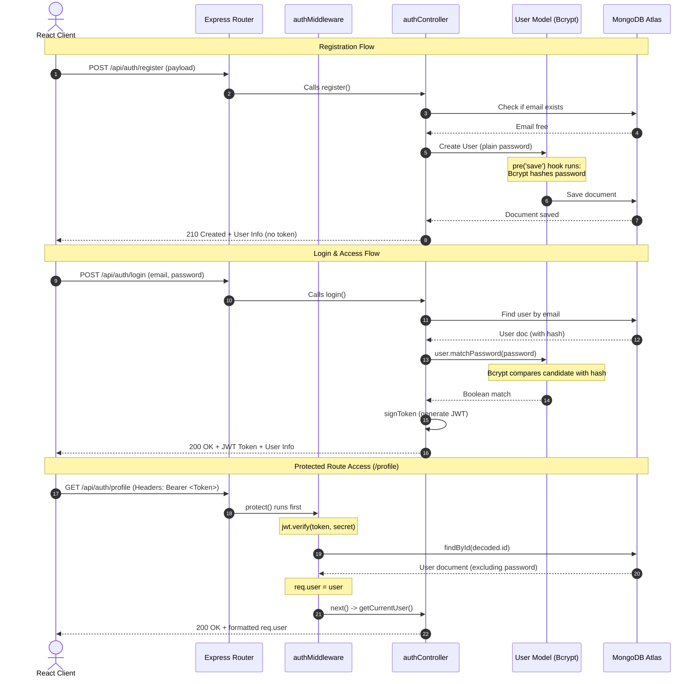

# Phase 22: Authentication Module Audit & Review

This document contains a comprehensive engineering audit of the **CP Scheduler** authentication module, analyzing code design, structure, security, and error handling.

---

## 📊 1. Authentication Flow Diagram

Here is a visual representation of the complete registration, login, and authorization loop:

---

## 🔍 2. Component Audits

### 📂 Folder Structure
- **Assessment**: Excellent. Follows standard MVC conventions with a clear separation between routing logic (`routes/`), business rules (`controllers/`), database schemas (`models/`), request filters (`middleware/`), and formatting utilities (`utils/`).

### 🗺️ Routes (`authRoutes.js`)
- **Assessment**: Extremely clean. Express router separates public (`/register`, `/login`) and private (`/me`, `/profile`, `/logout`) paths, with the `protect` middleware cleanly applied as a route guard.

### 🎮 Controllers (`authController.js`)
- **Assessment**: Robust. Uses modern `async/await` syntax, checks for parameter existence and length, and handles exceptions cleanly by passing them to `next(error)`.

### 🗄️ Models (`User.js`)
- **Assessment**: Production-ready. Leverages built-in mongoose validation schemas (lowercase, trims, regex matching) and includes:
  - **Mongoose pre-save middleware** to automatically hash passwords, separating security operations from controllers.
  - **Custom instance method** to encapsulate password comparison operations.

### 🔑 JWT & Bcrypt
- **Assessment**: Uses standard `bcryptjs` for encryption and `jsonwebtoken` for token signing. Token contains only the user's database `_id` as the payload, keeping token size small and avoiding data exposure.

### 🛡️ Security Audit
- **Security Checkpoints**:
  - **Password Safety**: Hashed with a salt factor of 10. Plain text passwords never touch MongoDB.
  - **Stateless Tokens**: Tamper-proof, signed with `JWT_SECRET`, expiring after `7d`.
  - **Data Leak Prevention**: Uses the `.select('-password')` mongoose query modifier and a formatting utility (`userFormatter.js`) to guarantee password hashes are never serialized in JSON responses.
  - **Account Enumeration Prevention**: Login failure returns a generic `"Invalid email or password"` rather than leaking whether the email exists.

### 💥 Error Handling
- **Assessment**: Centralized. Delegates validation and database errors to the global error middleware via `next(error)`, returning clean JSON wrappers instead of server crashes.

---

## 📈 3. Suggested Improvements (Future Readiness)

While the implementation is fully complete, here are best practices to implement as the codebase scales:

1. **Rate Limiting**: Add a rate-limiting middleware (like `express-rate-limit`) to the `/api/auth/login` and `/api/auth/register` endpoints to block brute-force attacks.
2. **Refresh Tokens**: Switch to a double-token setup (Access Tokens + Refresh Tokens) stored in secure, HttpOnly cookies rather than storing long-lived JWTs in local storage.
3. **Password Complexity**: Enforce special character requirements (e.g. uppercase, numbers) on registration using zxcvbn or custom regex.
